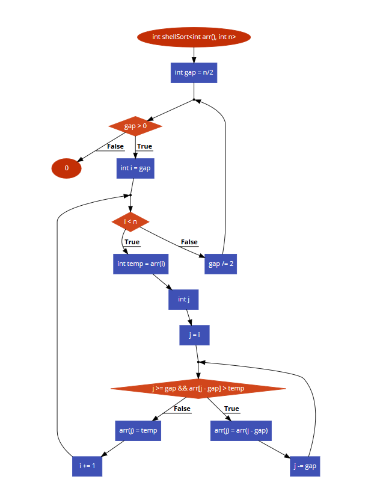

# Bài tập kiểm thử dòng điều kiện

#### Họ tên: Bùi Đức Anh
#### MSSV: 16020300   
#### Lớp: K61-CA-CLC1

## **Hàm đã chọn:**

```sh
1    int shellSort(int arr[], int n) 
     { 
2        for (int gap = n/2; gap > 0; gap /= 2) 
         { 
3            for (int i = gap; i < n; i += 1) 
             { 
             int temp = arr[i]; int j;             
4                 for (j = i; j >= gap && arr[j - gap] > temp; j -= gap) 
                     arr[j] = arr[j - gap];
                     arr[j] = temp; 
            } 
         } 
5      return 0; 
     } 
```

## **Bước 1: Code to Flowchart**



## **Bước 2: Find list of roads **
#### Path 1: 1 &rarr; 2 &rarr; 5
#### Path 2: 1 &rarr; 2 &rarr; 3 &rarr; 4 &rarr; 5  

## **Step 3 : Path condition**
#### Path 1 : 0 <= n <= 1
#### Path 2 : n >= 2

## **Step 4 : Generate testcase**
#### Path 1 : arr[] = {}, n = 0 || arr[] = {1}, n = 1
#### Path 2 : arr[] = {12, 5, 7, 9}, n = 4 || arr[] = {4, 2}, n = 2


## **Step 5 : Expected output**
#### Path 1 : Return arr[] = {}
#### Path 2 : Return arr[] = {5, 7, 9, 12} || Return arr[] = {2, 4}
