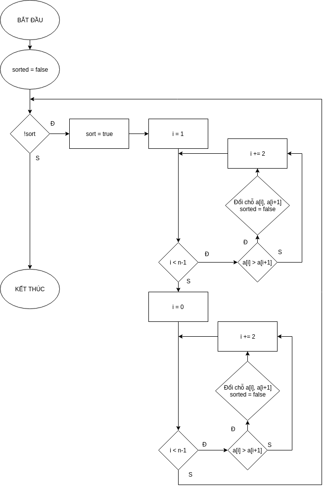

# Generation Unit Test for OddEven Sort Function


### Dao Tuan Anh
### 16020190
### K61-CA-CLC1
### _______________


### Source code: https://github.com/TheAlgorithms/C-Plus-Plus/blob/master/Sorting/OddEven%20Sort.cpp

```sh
1   void oddEven(vector<int> &arr, int size) {
2   	bool sorted = false;
3   	while( ! sorted ) {
4   		sorted = true;
5   		for(int i = 1; i < size-1; i += 2) {//Odd 
6   			if(arr[i] > arr[i+1]) {
7  				swap(arr[i], arr[i+1]);
8  				sorted = false;
9  			}
10  		}
11  		for(int i = 0; i < size-1; i += 2) {//Even
12  			if(arr[i] > arr[i+1]) {
13  				swap(arr[i], arr[i+1]);
14  				sorted = false;
15  			}
16  		}
17  	}
18  }
```

### 1. Flowchart



### 2. List of Road

#### Road 1: 1 &rarr; 2 &rarr; 3 &rarr; 4 &rarr; 5 &rarr; 11 &rarr; 3 &rarr; 17 &rarr; 18
#### Road 2: 1 &rarr; 2 &rarr; 3 &rarr; 4 &rarr; 5 &rarr; 6 &rarr; 11 &rarr; 12 &rarr; 3 &rarr; 17 &rarr; 18 
#### Road 3: 1 &rarr; 2 &rarr; 3 &rarr; 4 &rarr; 5 &rarr; 6 &rarr; 7 &rarr; 8 &rarr; 11 &rarr; 12 &rarr; 3 &rarr; 17 &rarr; 18
#### Road 4: 1 &rarr; 2 &rarr; 3 &rarr; 4 &rarr; 5 &rarr; 6 &rarr; 11 &rarr; 12 &rarr; 13 &rarr; 14 &rarr; 3 &rarr; 17 &rarr; 18
#### Road 5: 1 &rarr; 2 &rarr; 3 &rarr; 4 &rarr; 5 &rarr; 6 &rarr; 7 &rarr; 8 &rarr; 11 &rarr; 12 &rarr; 13 &rarr; 14 &rarr; 3 &rarr; 17 &rarr; 18


### 3. Path Conditions

#### Path 1: size <= 1
#### Path 2: size > 1, array already sorted
#### Path 3: size > 1, only odd positions don't sorted
#### Path 4: size > 1, only even positions don't sorted
#### Path 5: size > 1, array doesn't sorted

### 4. Generate Test Case

#### Path 1: n = 0, a[ ] = { }
#### Path 2: n = 5, a[ ] = {2, 15, 18, 53, 74}
#### Path 3: n = 6, a[ ] = {17, 2, 89, 5, 10, 12}
#### Path 4: n = 9, a[ ] = {2, 41, 12, 7, 53, 51, 74, 45, 99}
#### Path 5: n = 7, a[ ] = {89, 14, 52, 0, 16, 75, 45}

### 5. Expected Output
	
#### Path 1: Nothing to print
#### Path 2: 2, 15, 18, 53, 74
#### Path 3: 2, 5, 10, 12, 17, 89
#### Path 4: 2, 7, 12, 41, 45, 51, 53, 74, 99
#### Path 5: 0, 14, 16, 45, 53, 75, 89


