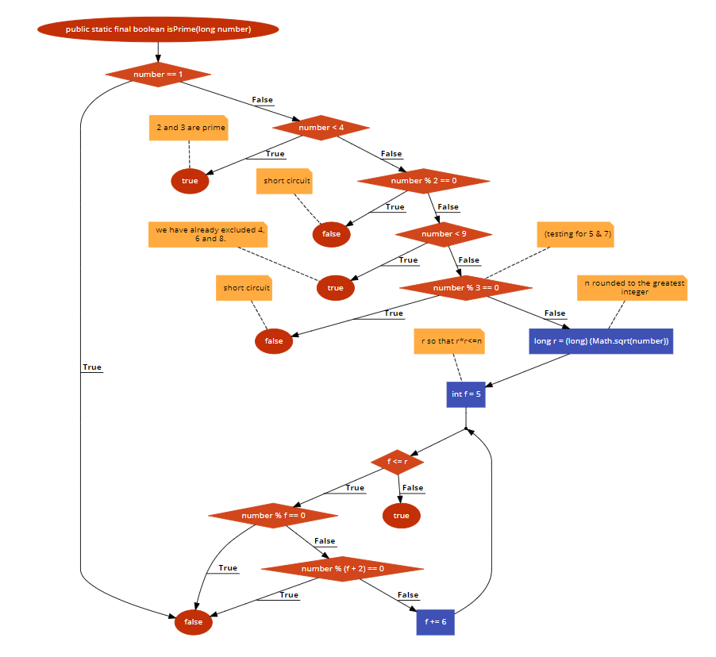

# Bài tập kiểm thử
- Họ và tên: Đỗ Ngọc Duy
- MSV: 16020216
- Lớp: K61-CA-CLC1
## Hàm đã chọn
- link : https://github.com/phishman3579/java-algorithms-implementation/blob/master/src/com/jwetherell/algorithms/mathematics/Primes.java
```sh
1 public static final boolean isPrime(long number) {
2        if (number == 1)
3            return false;
4        if (number < 4)
5            return true; // 2 and 3 are prime
6        if (number % 2 == 0)
7            return false; // short circuit
8        if (number < 9)
9            return true; // we have already excluded 4, 6 and 8.
10        // (testing for 5 & 7)
11       if (number % 3 == 0)
12            return false; // short circuit
13        long r = (long) (Math.sqrt(number)); // n rounded to the greatest integer
14        // r so that r*r<=n
15        int f = 5;
16        while (f <= r) {
17            if (number % f == 0)
18                return false;
19            if (number % (f + 2) == 0)
20                return false;
21            f += 6;
22        }
23        return true;
24    }
```

### 1. Flowchart


### 2. Đường đi

#### Road 1: 1 &rarr; 2 &rarr; 3 &rarr; 24
#### Road 2: 1 &rarr; 2 &rarr; 4 &rarr; 5 &rarr; 24 
#### Road 3: 1 &rarr; 2 &rarr; 4 &rarr; 6 &rarr; 7 &rarr; 24 
#### Road 4: 1 &rarr; 2 &rarr; 4 &rarr; 6 &rarr; 8 &rarr; 9 &rarr; 24 
#### Road 5: 1 &rarr; 2 &rarr; 4 &rarr; 6 &rarr; 8 &rarr; 11 &rarr; 12 &rarr; 24 
#### Road 6: 1 &rarr; 2 &rarr; 4 &rarr; 6 &rarr; 8 &rarr; 11 &rarr; 13 &rarr; 15 &rarr; 16 &rarr; 17 &rarr; 18 &rarr; 24 
#### Road 7: 1 &rarr; 2 &rarr; 4 &rarr; 6 &rarr; 8 &rarr; 11 &rarr; 13 &rarr; 15 &rarr; 16 &rarr; 17 &rarr; 19 &rarr; 20 &rarr; 24
#### Road 8: 1 &rarr; 2 &rarr; 4 &rarr; 6 &rarr; 8 &rarr; 11 &rarr; 13 &rarr; 15 &rarr; 16 &rarr; 17 &rarr; 19 &rarr; 21 &rarr; 16 &rarr; 23 &rarr; 24
#### Road 9: 1 &rarr; 2 &rarr; 4 &rarr; 6 &rarr; 8 &rarr; 11 &rarr; 13 &rarr; 15 &rarr; 16 &rarr; 23 &rarr; 24


### 3. Hệ phương trình

#### Road 1: number == 1
#### Road 2: number != 1 && number < 4
#### Road 3: number != 1 && number >= 4 && number % 2 == 0
#### Road 4: number != 1 && number >= 4 && number % 2 != 0 && number < 9
#### Road 5: number != 1 && number >= 4 && number % 2 != 0 && number >= 9 && number % 3 == 0
#### Road 6: number != 1 && number >= 4 && number % 2 != 0 && number >= 9 && number % 3 != 0 &&  f = 5 && r = sqrt(number) && f <= r && number % f == 0 
#### Road 7: number != 1 && number >= 4 && number % 2 != 0 && number >= 9 && number % 3 != 0 &&  f = 5 && r = sqrt(number) && f <= r && number % f != 0 && number % (f+2) == 0 
#### Road 8: number != 1 && number >= 4 && number % 2 != 0 && number >= 9 && number % 3 != 0 &&  f = 5 && r = sqrt(number) && f <= r && number % f != 0 && number % (f+2) != 0 && f += 6 && f > r
#### Road 9: number != 1 && number >= 4 && number % 2 != 0 && number >= 9 && number % 3 != 0 &&  f = 5 && r = sqrt(number) && f > r

### 4. Tạo Test Case

#### Road 1: number = 1
#### Road 2: number = 2
#### Road 3: number = 4
#### Road 4: number = 5
#### Road 5: number = 15
#### Road 6: number = 35
#### Road 7: number = 49
#### Road 8: number = 101
#### Road 9: number = 23

### 5. Output mong đợi
	
#### Road 1:false
#### Road 2:true
#### Road 3:false
#### Road 4:true
#### Road 5:false
#### Road 6:false
#### Road 7:false
#### Road 8:true
#### Road 9:true
