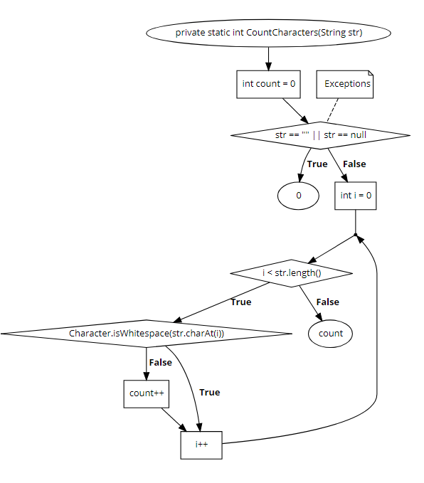

# Generation Unit Test for CountChar Function


### Họ và tên : Đỗ Tuấn Anh
### Lớp : K61CACLC1;
### Mã sinh viên : 16020191
### _______________


### Source code: https://github.com/TheAlgorithms/Java/blob/master/Others/CountChar.java

```sh
1   private static int CountCharacters(String str) {
2
3   	int count = 0;
4
5   	if(str == "" || str == null) //Exceptions
6		{ 
7			return 0; 
8		}
9        for(int i = 0; i < str.length(); i++) {
10        	if(!Character.isWhitespace(str.charAt(i))) {
11        		count++;
12			}}
13
14        return count; }

```

### 1. Flowchart



### 2. List of Road

#### Path 1: 1 &rarr; 2 &rarr; 3 &rarr; 4 &rarr; 5 &rarr; 6 &rarr; 7 
#### Path 2: 1 &rarr; 2 &rarr; 3 &rarr; 4 &rarr; 5 &rarr; 9 &rarr; 14 
#### Path 3: 1 &rarr; 2 &rarr; 3 &rarr; 4 &rarr; 5 &rarr; 9 &rarr; 10 &rarr; 11 &rarr; 12 &rarr; 13 &rarr; 14
#### Path 4: 1 &rarr; 2 &rarr; 3 &rarr; 4 &rarr; 5 &rarr; 9 &rarr; 10 &rarr;  13 &rarr; 14


### 3. Path Conditions

#### Path 1: str == "" || str == null
#### Path 2: str != "" && str != null && i > str.length
#### Path 3: str != "" && str != null && i < str.length && Character.isWhitespace(str.charAt(i)) == false
#### Path 4: str != "" && str != null && i < str.length && Character.isWhitespace(str.charAt(i)) == true

### 4. Generate Test Case

#### Path 1: str = ""
#### Path 2: Infeasible
#### Path 3: str = "HelloWorld"
#### Path 4: str = "Hello World "


### 5. Expected Output
	
#### Path 1: 0
#### Path 2: Infeasible
#### Path 3: 10
#### Path 4: 10

