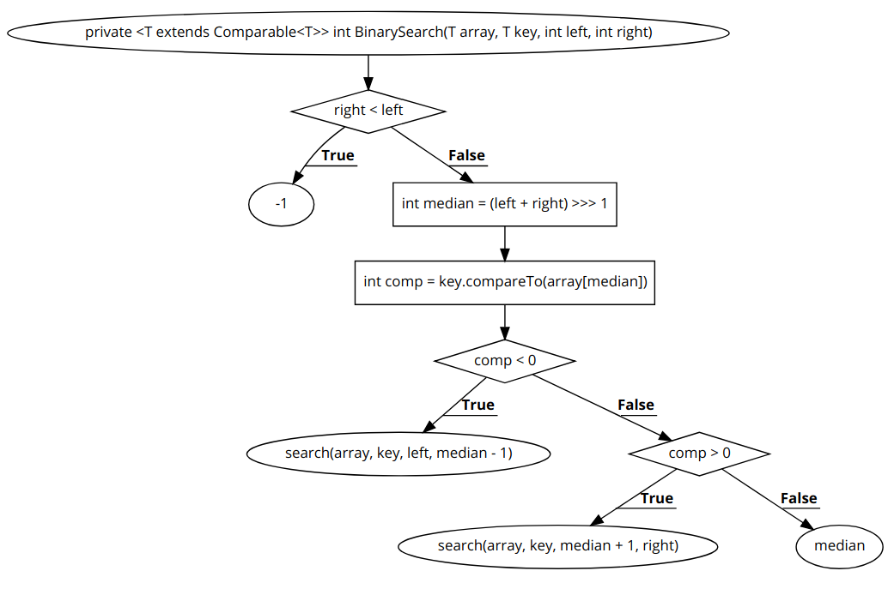

# Báo cáo test whitebox cho function Binary Search
### Họ và tên: Đỗ Xuân Anh
### MSSV: 16020192
### Lớp: K61-CA-CLC1
## Code Binary Search
Link repo github: [Binary Search](https://github.com/TheAlgorithms/Java/blob/master/Searches/BinarySearch.java)
```java
    private <T extends Comparable<T>> int BinarySearch(T array[], T key, int left, int right)
    {
        if (right < left)                                           //1
            return -1;                                              //2
        int median = (left + right) >>> 1;                          //3
        int comp = key.compareTo(array[median]);                    //4
        if (comp < 0) {                                             //5
            return search(array, key, left, median - 1);            //6
        }                                                           //7
        if (comp > 0) {                                             //8
            return search(array, key, median + 1, right);           //9
        }                                                           //10
        return median;                                              //11
    }
```
## Đồ thị đường đi

## Liệt kê các đường đi
### Đường đi số 1: 1 &rarr; 2 &rarr;
### Đường đi số 2: 1 &rarr; 3 &rarr; 4 &rarr; 5 &rarr; 6
### Đường đi số 2: 1 &rarr; 3 &rarr; 4 &rarr; 5 &rarr; 8 &rarr; 9
### Đường đi số 2: 1 &rarr; 3 &rarr; 4 &rarr; 5 &rarr; 8 &rarr; 11
## Phương trình đường đi cho mỗi đường đi
### Đường đi số 1:
> 1 &rarr; True <br>
    right < left
