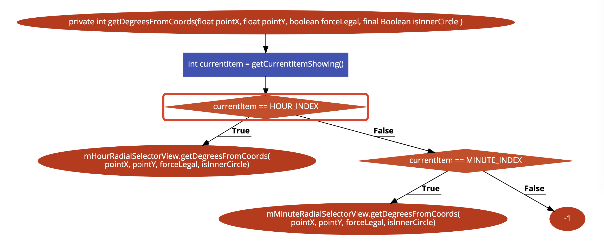

# Bài tập kiểm thử
    Đồng Việt Hoàng - 16020228
    Lớp: K61 CACLC1
## Source: [Github](https://github.com/flavienlaurent/datetimepicker/blob/master/datetimepicker-library/src/com/sleepbot/datetimepicker/time/RadialPickerLayout.java?fbclid=IwAR2s7tzfxqRLEOQmkX0cs-YzxvTzLn_rwIu4e9_Gmj_hJMAdjrdY80BmXYA)
## Chọn hàm:
```java
1. private int getDegreesFromCoords(float pointX, float pointY, boolean forceLegal,final Boolean[] isInnerCircle) {
2.        int currentItem = getCurrentItemShowing();
3.        if (currentItem == HOUR_INDEX) {
4.            return mHourRadialSelectorView.getDegreesFromCoords(pointX, pointY, forceLegal, isInnerCircle);
5.        } else if (currentItem == MINUTE_INDEX) {
6.            return mMinuteRadialSelectorView.getDegreesFromCoords(pointX, pointY, forceLegal, isInnerCircle);
7.        } else {
8.            return -1;
9.        }
10.    }
```
## Source:
[Github](https://github.com/flavienlaurent/datetimepicker/blob/master/datetimepicker-library/src/com/sleepbot/datetimepicker/time/RadialPickerLayout.java?fbclid=IwAR2s7tzfxqRLEOQmkX0cs-YzxvTzLn_rwIu4e9_Gmj_hJMAdjrdY80BmXYA)

## Bước 1: Flowchart

## Bước 2: Liệt kê các đường đi 
### Đường số 1: (1->2->3->4)
### Đường số 2: (1->2->3->5->6)
### Đường số 3: (1->2->3->5->8)
## Bước 3: Lập phương trình cho mỗi đường đi
### Đường số 1:
Để 3 -> 4 thì 3 phải có giá trị là True nên 'currentItem == HOUR_INDEX'
### Đường số 2:
Để 3 -> 5 thì 3 phải có giá trị False nên 'currentItem != HOUR_INDEX'

Để 5 -> 6 thì 5 phải có giá trị True nên 'currentItem == MINUTE_INDEX'

Vậy -> 'currentItem != HOUR_INDEX' && 'currentItem == MINUTE_INDEX'
### Đường số 3:
Để 5 -> 8 thì 5 phải có giá trị False nên 'currentItem != MINUTE_INDEX'

Kết hợp với điều kiện tư 3 -> 5
Ta có : 'currentItem != HOUR_INDEX' && 'currentItem != MINUTE_INDEX'

## Bước 4: Tính giá trị mong đợi và tạo bộ kiểm thử hoàn chỉnh
### Đường đi số 1:
Input: currentItem == HOUR_INDEX

Expected Output: mHourRadialSelectorView.getDegreesFromCoords(pointX pointY, forceLegal, isInnerCircle);
### Đường đi số 2:
Input: currentItem != HOUR_INDEX && 'currentItem == MINUTE_INDEX'

Expected Output: mMinuteRadialSelectorView.getDegreesFromCoords(pointX, pointY, forceLegal, isInnerCircle);
### Đường đi số 3:
Input currentItem != HOUR_INDEX && 'currentItem != MINUTE_INDEX'

Expected Output: -1