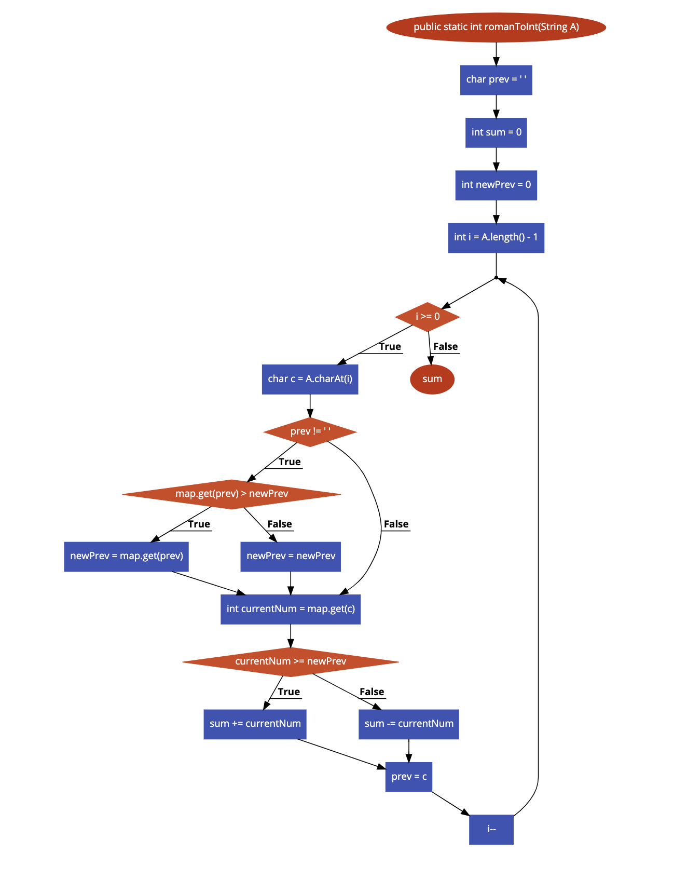

# Bài tập kiểm thử dòng điều kiện

#### Họ tên: Dương Quang Khải
#### MSSV: 16020242
#### Lớp: K61-CA-CLC1

Repo: [https://github.com/TheAlgorithms/Java/blob/master/Conversions/RomanToInteger.java](https://github.com/TheAlgorithms/Java/blob/master/Conversions/RomanToInteger.java)

## **Hàm đã chọn:**

```sh
private static Map<Character, Integer> map = new HashMap<>() {{
        put('I', 1);
        put('V', 5);
        put('X', 10);
        put('L', 50);
        put('C', 100);
        put('D', 500);
        put('M', 1000);
    }};

1    public static int romanToInt(String A) {
2        char prev = ' ';
3        int sum = 0;
4        int newPrev = 0;
5        for (int i = A.length() - 1; i >= 0; i--) {
6            char c = A.charAt(i);
7            if (prev != ' ') {
8                if(map.get(prev) > newPrev){
9                    newPrev = map.get(prev)
10                }
11                else{
12                    newPrev = newPrev
13                }
14            }
15            int currentNum = map.get(c);
16            if (currentNum >= newPrev) {
17                sum += currentNum;
18            } else {
19                sum -= currentNum;
20            }
21            prev = c;
22        }
23        return sum;
24    }
```

## **<u>Bước 1: Lập đồ thị</u>**



## **<u>Bước 2: Liệt kê các đường đi</u>**

### **Đường số 1**: 1 &rarr; 2 &rarr; 3 &rarr; 4 &rarr; 5 &rarr; 23

### **Đường số 2**: 1 &rarr; 2 &rarr; 3 &rarr; 4 &rarr; 5 &rarr; 6 &rarr; 7 &rarr; 8 &rarr; 9 &rarr; 15 &rarr; 16 &rarr; 17 &rarr; 21 &rarr; 23

### **Đường số 3**: 1 &rarr; 2 &rarr; 3 &rarr; 4 &rarr; 5 &rarr; 6 &rarr; 7 &rarr; 11 &rarr; 12 &rarr; 15 &rarr; 16 &rarr; 17 &rarr; 21 &rarr; 23

### **Đường số 4**: 1 &rarr; 2 &rarr; 3 &rarr; 4 &rarr; 5 &rarr; 6 &rarr; 7 &rarr; 15 &rarr; 16 &rarr; 17 &rarr; 21 &rarr; 23

### **Đường số 5**: 1 &rarr; 2 &rarr; 3 &rarr; 4 &rarr; 5 &rarr; 6 &rarr; 7 &rarr; 8 &rarr; 9 &rarr; 15 &rarr; 18 &rarr; 19 &rarr; &rarr; 21 &rarr; 23

### **Đường số 6**: 1 &rarr; 2 &rarr; 3 &rarr; 4 &rarr; 5 &rarr; 6 &rarr; 7 &rarr; 11 &rarr; 12 &rarr; 15 &rarr; 18 &rarr; 19 &rarr; 21 &rarr; 23

### **Đường số 7**: 1 &rarr; 2 &rarr; 3 &rarr; 4 &rarr; 5 &rarr; 6 &rarr; 7 &rarr; 15 &rarr; 18 &rarr; 19 &rarr; 21 &rarr; 23 

## **<u>Bước 3: Lập phương trình đường đi (Path-condition)</u>**

### **Đường số 1**: 1 &rarr; 2 &rarr; 3 &rarr; 4 &rarr; 5 &rarr; 23

- Để từ 5 &rarr; 23 thì phải có giá trị **false** &rarr; độ dài chuỗi đầu vào = 0 (1) <br/>
(1) &rarr; A là 1 chuỗi rỗng

### **Đường số 2**: 1 &rarr; 2 &rarr; 3 &rarr; 4 &rarr; 5 &rarr; 6 &rarr; 7 &rarr; 8 &rarr; 9 &rarr; 15 &rarr; 16 &rarr; 17 &rarr; 21 &rarr; 23

- Để từ 5 &rarr; 6,7,8,9 thì A phải là một chuỗi không rỗng và giá trị lấy từ Map với index là phần tử prev phải lớn hơn newPrev
- Để từ 15 &rarr; 16,17,21,23 thì giá trị từ Map với index là kí tự trong xâu đang xét phải lớn hơn hoặc bằng giá trị newPrev

### **Đường số 3**: 1 &rarr; 2 &rarr; 3 &rarr; 4 &rarr; 5 &rarr; 6 &rarr; 7 &rarr; 11 &rarr; 12 &rarr; 15 &rarr; 16 &rarr; 17 &rarr; 21 &rarr; 23

- Để từ 5 &rarr; 6,7,11,12 thì A phải là một chuỗi không rỗng và giá trị lấy từ Map với index là phần tử prev phải nhỏ hơn newPrev
- Để từ 15 &rarr; 16,17,21,23 thì giá trị từ Map với index là kí tự trong xâu đang xét phải lớn hơn hoặc bằng giá trị newPrev

### **Đường số 4**: 1 &rarr; 2 &rarr; 3 &rarr; 4 &rarr; 5 &rarr; 6 &rarr; 7 &rarr; 15 &rarr; 16 &rarr; 17 &rarr; 21 &rarr; 23

- Để từ 5 &rarr; 6,7 thì biến prev là rỗng
- Để từ 15 &rarr; 16,17,21,23 thì giá trị từ Map với index là kí tự trong xâu đang xét phải lớn hơn hoặc bằng giá trị newPrev

### **Đường số 5**: 1 &rarr; 2 &rarr; 3 &rarr; 4 &rarr; 5 &rarr; 6 &rarr; 7 &rarr; 8 &rarr; 9 &rarr; 15 &rarr; 18 &rarr; 19 &rarr; &rarr; 21 &rarr; 23

- Để từ 5 &rarr; 6,7,8,9 thì A phải là một chuỗi không rỗng và giá trị lấy từ Map với index là phần tử prev phải lớn hơn newPrev
- Để từ 15 &rarr; 18,19,21,23 thì giá trị từ Map với index là kí tự trong xâu đang xét phải nhỏ hơn giá trị newPrev

### **Đường số 6**: 1 &rarr; 2 &rarr; 3 &rarr; 4 &rarr; 5 &rarr; 6 &rarr; 7 &rarr; 11 &rarr; 12 &rarr; 15 &rarr; 18 &rarr; 19 &rarr; 21 &rarr; 23

- Để từ 5 &rarr; 6,7,11,12 thì A phải là một chuỗi không rỗng và giá trị lấy từ Map với index là phần tử prev phải nhỏ hơn newPrev
- Để từ 15 &rarr; 18,19,21,23 thì giá trị từ Map với index là kí tự trong xâu đang xét phải nhỏ hơn giá trị newPrev

### **Đường số 7**: 1 &rarr; 2 &rarr; 3 &rarr; 4 &rarr; 5 &rarr; 6 &rarr; 7 &rarr; 15 &rarr; 18 &rarr; 19 &rarr; 21 &rarr; 23 

- Để từ 5 &rarr; 6,7 thì biến prev là rỗng
- Để từ 15 &rarr; 18,19,21,23 thì giá trị từ Map với index là kí tự trong xâu đang xét phải nhỏ hơn giá trị newPrev

## **<u>Bước 4: Tính giá trị mong đợi và tạo bộ kiểm thử hoàn chỉnh</u>**

### **Đường số 1**:
- Input: string A = ' '
- Expected output: null

### **Đường số 2 &rarr; 7**:
- Input: string A = 'XVII'
- Expected output: 17