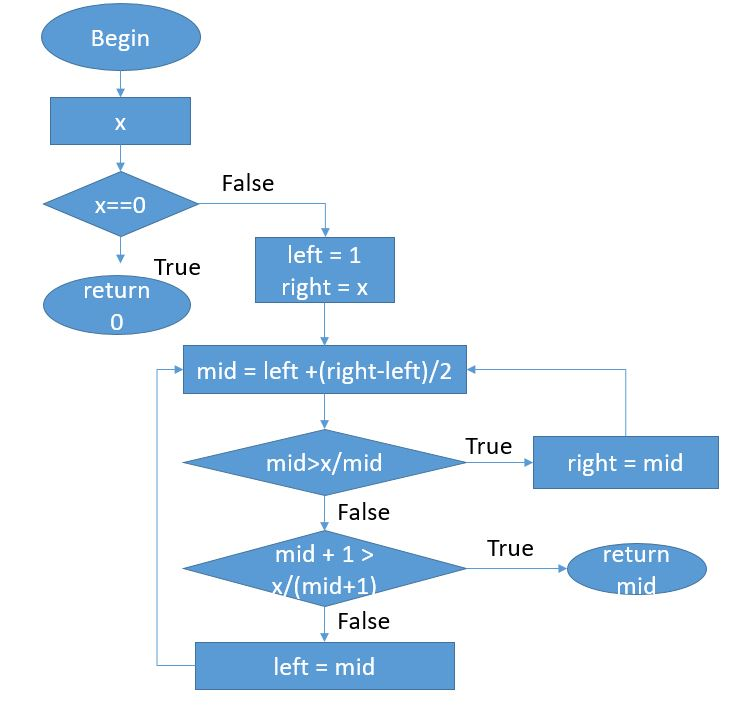


### **- Họ và tên: Lê Trung Nam Nhật**
### **- MSV: 16021620**
## **<u>Source code</u>**
#### ** https://github.com/begeekmyfriend/leetcode/blob/a147a5756860e023968364e3374dfd78892f5340/069_sqrt/sqrt.c#L10**
```C++
1 static int mySqrt(int x)
2 {
3     if (x == 0) {												
4         return 0;												
5     }															

6     unsigned int left = 1;										
7     unsigned int right = (unsigned int) x;						
8     for (; ;) {													
9         unsigned int mid = left + (right - left) / 2;			
10        if (mid > x/mid) {										
11            right = mid;										
12        } else {												
13            if (mid + 1 > x/(mid + 1)) {						
14                return mid;										
15            } else {											
16                left = mid;										
17            }													
18        }														
19    }															
20 }			
```
## **<u>Step 1: FlowChart</u>**



## **<u>Step 2: Paths</u>**
#### **Path 1:** 1 &rarr; 2 
#### **Path 1:** 4 &rarr; 5 &rarr; 6 &rarr; 7 &rarr; 8 &rarr; 9 &rarr; 7
#### **Path 1:** 4 &rarr; 5 &rarr; 6 &rarr; 7 &rarr; 10 &rarr; 11 &rarr; 12
#### **Path 1:** 4 &rarr; 5 &rarr; 6 &rarr; 7 &rarr; 10 &rarr; 13 &rarr; 14 &rarr; 7

## **<u>Step 3: Path equation </u>**

#### **true: x==0 → sqrt(x) = 0**
#### **true: mid > x/mid → right = mid**
#### **true: mid + 1 > x/(mid+1) → sqrt(x) = mid**
#### **true: !(mid + 1 > x/(mid + 1)) → left = mid**

## **<u>Step 4: Solve</u>**
### **Example x=4**
#### **x==4 → x!=0**
#### **We have left = 1, right = 4**
#### **mid = left + (right - left) / 2 = 3**
#### **3 > 4/3  → right = 3**
#### **→ mid = left + (right - left) / 2 = 2**
#### **2 = 4/2 and (mid + 1) > x/(mid + 1)**
#### **→ sqrt(x) = mid = 2**


