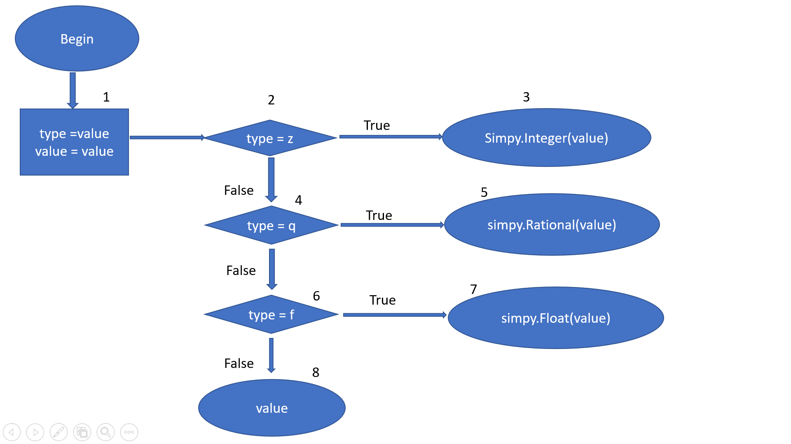

# **BÀI TẬP KIỂM THỬ**
### **- Họ và tên: Lê Trung Thông**
### **- MSV: 16020286**
### **- Lớp: K61-CA-CLC2**
## **<u>Function</u>**
### - Link git:
https://github.com/mathics/Mathics/blob/395f307e758a84247b891f887368d70202b33254/mathics/core/numbers.py#L119
```python
def unpickle_mp(value):
	type, value = value
	if type == 'z':
		return sympy.Integer(value)
	elif type == 'q':
		return sympy.Rational(value)
	elif type == 'f':
		return sympy.Float(value)
	else:
		return value
```
## Control flow graph
****
## Paths
#### Path 1: 1 => 2 => 3
#### Path 2: 1 => 2 => 4 => 5
#### Path 3: 1 => 2 => 4 => 6 => 7
#### Path 4: 1 =>2 => 4 => 6 => 8

## Path Equations
`type = value`
#### 1: True if value = 'z'
#### 2: True if value != 'z' && value = 'q'
#### 3: True if value != 'z' && value != 'q' && value = 'f'
#### 4: True if value != 'z' && value != 'q' && value != 'f'

## Solving
- Test case 1:
	- Input: value = 'z'
	- Output: sympy.Integer(value)
- Test case 2:
	- Input: value = 'q'
	- Output: sympy.Rational(value)
- Test case 3:
	- Input: value = 'f'
	- Output: sympy.Float(value)
- Test case 4:
	- Input: value = 'a'
	- Output: value


