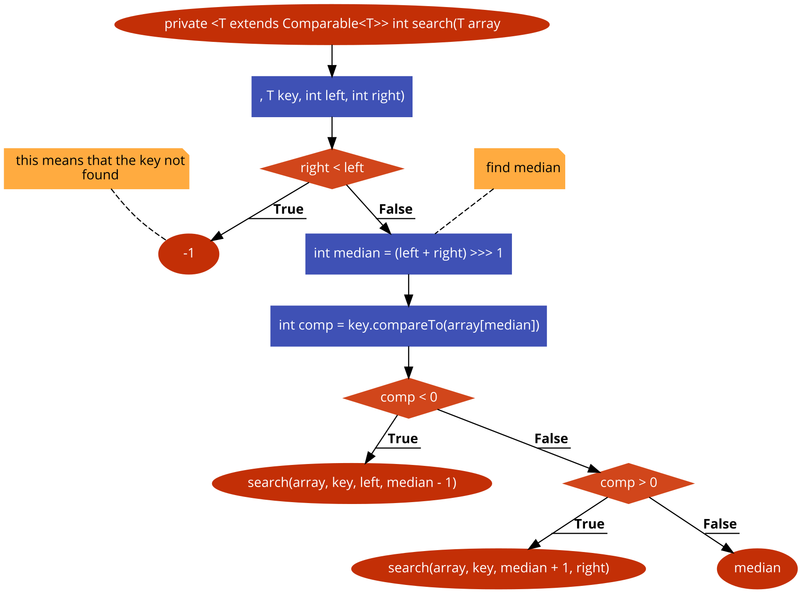

 Bài tập kiểm thử dòng điều kiện

#### Họ tên: Lê Viết Huy
#### MSSV: 16020240  
#### Lớp: K61-CA-CLC1

## **Hàm đã chọn:**

```sh
1  private <T extends Comparable<T>> int search(T array[], T key, int left, int right){
    2    if (right < left) return -1; // this means that the key not found

        // find median
        int median = (left + right) >>> 1;
        int comp = key.compareTo(array[median]);

     3   if (comp < 0) {
            return search(array, key, left, median - 1);
        }

      4  if (comp > 0) {
            return search(array, key, median + 1, right);
        }

       5 return median;
    }
```
## **Bước 1: Code to Flowchart**



## **Bước 2: Find list of roads **
#### Path 1: 1 &arr; 2
#### Path 2: 1 &arr; 2 &arr; 3
#### Path 3: 1 &arr; 2 &arr; 3 @arr; 4
#### Path 4: 1 &arr; 2 &arr; 3 @arr; 4 @arr; 5

## **Step 3 : Path condition**
#### Path 1 : right < left
#### Path 2 : comp < 0
#### Path 3 : comp > 0
#### Path 4 : comp == 0

## **Step 4 : Generate testcase**

#### Path 1
arr[] = {1, 2, 3} key = 4
#### Path 2
arr[] = {1, 2, 3, 4 ,5 , 6, 7, 8 } key = 4

## **Step 5 : Expected output**
#### Path 1 : Key Not Found
#### Path 2 : Key = 4
