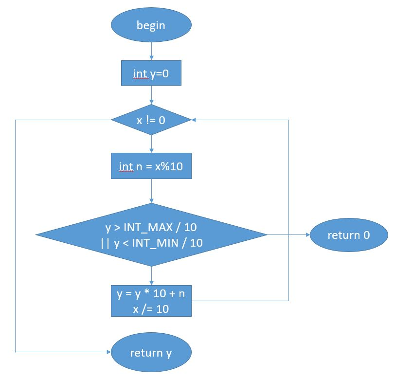


### **- Họ và tên: Trần Thế Nam**
### **- MSV: 16022413**
## **<u>Source code</u>**
### https://github.com/begeekmyfriend/leetcode/blob/a147a5756860e023968364e3374dfd78892f5340/007_reverse_integer/reverse_integer.c#L5
```C++
1 static int reverse(int x)
2 {
3     int y = 0;
4     while (x != 0) {
5         int n = x % 10;
          // Checking the over/underflow.
          // Actually, it should be y>(INT_MAX-n)/10, but n/10 is 0, so omit it.
6         if (y > INT_MAX / 10 || y < INT_MIN / 10) {
7             return 0;
8         }
9         y = y * 10 + n;
10        x /= 10;
11    }
12    return y;
13 }		
```
## **<u>Step 1: FlowChart</u>**



## **<u>Step 2: Paths</u>**
#### **Path 1:** 3 &rarr; 4 &rarr; 12
#### **Path 2:** 3 &rarr; 4 &rarr; 5 &rarr; 6 &rarr; 7 
#### **Path 3:** 3 &rarr; 4 &rarr; 5 &rarr; 9 &rarr; 10 &rarr; 12

## **<u>Step 3: Path equation </u>**

### **Path1**
#### **x==0 &rarr return 0**

### **Path2**
#### x!=0 
#### y > INT_MAX / 10 || y < INT_MIN / 10 

### **Path1**
#### x!=0 
#### y > INT_MAX / 10 || y < INT_MIN / 10 
