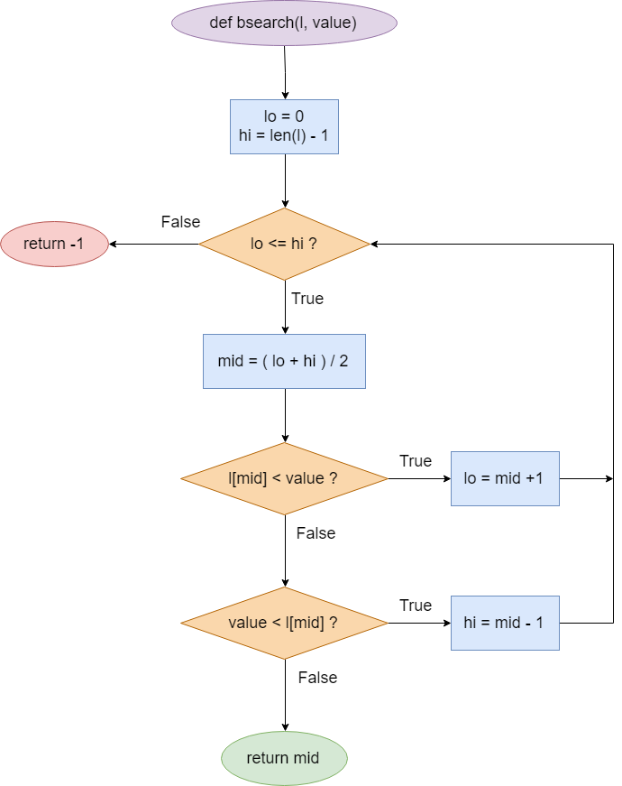

# Bài tập kiểm thử dòng điều kiện

#### Họ và tên: Nguyễn Thanh Tùng
#### MSV: 16020063
#### Lớp: K61 CA CLC2

## **Hàm đã chọn**
Link github: [bin_search.py](https://github.com/qiwsir/algorithm/blob/master/bin_search.py)  (line 48-58)
```python
1	def bsearch(l, value):
2		lo, hi = 0, len(l)-1
3		while lo <= hi:
4			mid = (lo + hi) / 2
5			if l[mid] < value:
6				lo = mid + 1
7			elif value < l[mid]:
8				hi = mid - 1
9			else:
10				return mid
11		return -1
```
## **<u>Bước 1</u>: Lập sơ đồ thuật toán**



## **<u>Bước 2</u>: Liệt kê các đường đi**
#### **Đường đi số 1:** 1 &rarr; 2 &rarr; 3 &rarr; 11
#### **Đường đi số 2:** 1 &rarr; 2 &rarr; 3 &rarr; 4 &rarr; 5 &rarr; 6
#### **Đường đi số 3:** 1 &rarr; 2 &rarr; 3 &rarr; 4 &rarr; 5 &rarr; 7 &rarr; 8
#### **Đường đi số 4:** 1 &rarr; 2 &rarr; 3 &rarr; 4 &rarr; 5 &rarr; 7 &rarr; 9 &rarr; 10

## **<u>Bước 3</u>: Lập phương trình đường đi**
#### Đường đi số 1:  len(l) = 0
#### Đường đi số 2:  l[mid] < value
#### Đường đi số 3:  value < l[mid]
#### Đường đi số 4:  l[mid] = value

## **<u>Bước 4</u>: Tạo các bộ giá trị kiểm thử
#### Đường đi số 1:  l = [ ], value = 0
#### Đường đi số 2:  l = [ 1, 2, 3], value = 3
#### Đường đi số 3:  l = [ 1, 2, 3], value = 1
#### Đường đi số 4:  l = [ 1, 2, 3], value = 2

## **<u>Bước 5</u>: Tạo bộ kiểm thử hoàn chỉnh
#### Đường đi số 1: 
*Test case 1*:
- input: l = [ ], value = 0
- expect output: -1
#### Đường đi số 2: 
*Test case 2*:
- l = [ 1, 2, 3], value = 3
- expect output: 3
#### Đường đi số 3: 
*Test case 3*:
- input:  l = [ 1, 2, 3], value = 1
- expect output: 1
#### Đường đi số 4: 
*Test case 4*:
- input:  l = [ 1, 2, 3], value = 2
- expect output: 2
#### Thêm:
*Test case 5*:
- input: l= [1, 3, 5, 7], value = 6
- expect output: -1

*Test case 6*:
- input: l= [1, 3, 5, 7], value = 0
- expect output: -1

*Test case 7*:
- input: l= [1, 3, 5, 7], value = 5
- expect output: 5


