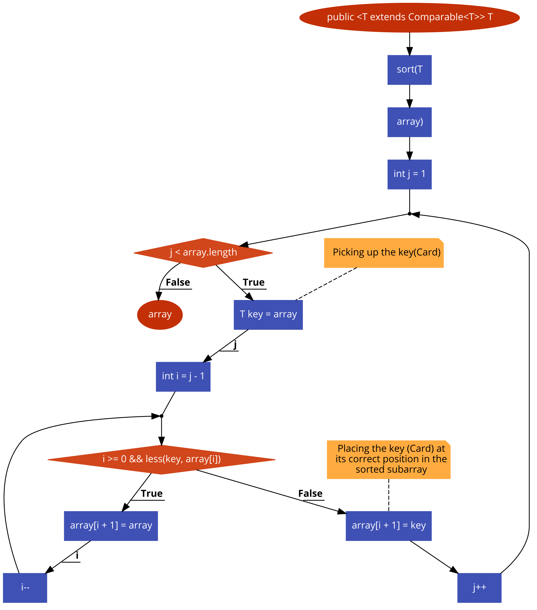

# **BÀI TẬP KIỂM THỬ**
### **- Họ và tên: Nguyễn Tiến Tuấn Anh**
### **- MSV: 16020199**
### **- Lớp: K61-CA-CLC1**
## **<u>Hàm chọn</u>**
```java
1  public <T extends Comparable<T>> T[] sort(T[] array) {
2       for (int j = 1; j < array.length; j++) {
3           T key = array[j];
4          int i = j - 1;
5           while (i >= 0 && less(key, array[i])) {
6              array[i + 1] = array[i];
7               i--; }          
8          array[i + 1] = key;
9      }
10      return array; }

```
## **<u>Bước 1: Lập đồ thị</u>**

## **<u>Bước 2: Liệt kê các đường đi</u>**
### **Đường số 1**: 1 &rarr; 2 &rarr; 3 &rarr; 4 &rarr; 5 &rarr;  6 &rarr; 7 &rarr; 8 &rarr; 9 &rarr; 10 

### **Đường số 2**: 1 &rarr; 2 &rarr; 3 &rarr; 4

## **Bước 3: Lập phương trình đường đi (Path-condition)**

### **Đường số 1**: 1 &rarr; 2 &rarr; 3 &rarr; 4 &rarr; 5 &rarr;  6 &rarr; 7 &rarr; 8 &rarr; 9 &rarr; 10 

