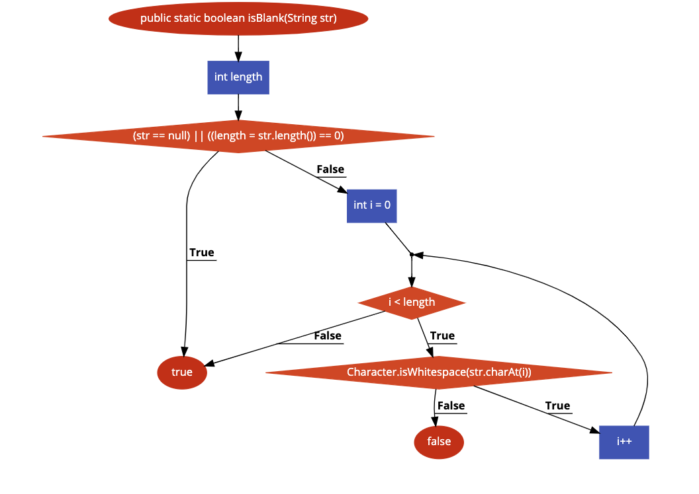

# Bài tập kiểm thử dòng điều kiện
### Họ tên: Nguyễn Trường Giang
### MSSV :16020219
### Lớp : K61-CA-CLC1

## ** Hàm đã chọn**:
## https://github.com/seata/seata/blob/develop/common/src/main/java/io/seata/common/util/StringUtils.java

```java
1    public static boolean isBlank(String str) {
2        int length;
3
4        if ((str == null) || ((length = str.length()) == 0)) {
5            return true;
6        }
7        for (int i = 0; i < length; i++) {
8            if (!Character.isWhitespace(str.charAt(i))) {
9                return false;
10            }
11        }
12        return true;
12    }
```
## **Bước 1: Lập đồ thị**

## **Bước 2: Liệt kê các đường đi**

### Path 1:  1 &rarr; 2 &rarr; 3 &rarr; 4 &rarr; 5 

### Path 2:  1 &rarr; 2 &rarr; 3 &rarr; 4 &rarr; 7 &rarr; 12

### Path 3:  1 &rarr; 2 &rarr; 3 &rarr; 4 &rarr; 7 &rarr; 8 &rarr; 9
 
### Path 4:  1 &rarr; 2 &rarr; 3 &rarr; 4 &rarr; 7 &rarr; 8 &rarr; 12


### Path Condition
### Path 1: str==null || str.length()==0

### Path 2: str!=null && str.length()!=0 && i>str.length

### Path 3: str!=null && str.length()!=0 && i<str.length && Character.isWhitespace(str.charAt(i)) == false

### Path 4: str!=null && str.length()!=0 && i<str.length && Character.isWhitespace(str.charAt(i)) == true


### Testcase

### Path 1: str=""
### Path 2: can't reach
### Path 3: str ="Giang"
### Path 4: str = "Giang"

### 5. Expected Output
	
#### Path 1: false
#### Path 2: can't reach
#### Path 3: true
#### Path 4: true
