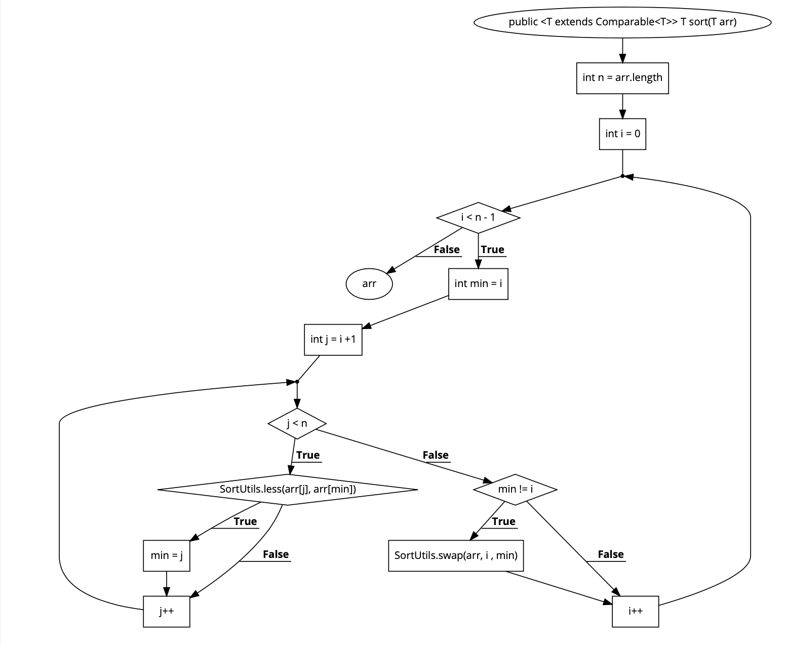

# **BÀI TẬP KIỂM THỬ**
### **- Họ và tên: Nguyễn Xuân Việt Cường**
### **- MSV: 16020208**
### **- Lớp: K61-CA-CLC1**
## **<u>Hàm đã chọn</u>**
```java
1 public <T extends Comparable<T>> T sort(T arr) {
2        int n = arr.length;
3        int i = 0;
4        while(i < n-1)
5        {
6            int min = i;
7            int j = i+1;
8            while(j < n)
9            {
10                if (SortUtils.less(arr[j], arr[min])) 
11                {
12                    min = j;
13                }
14                j++;
15            }
16            if (min != i) {
17                SortUtils.swap(arr, i , min);
18            }
19            i++;
20        }
21        return arr;
22    }
```
## **<u>Bước 1: Lập đồ thị</u>**

## **<u>Bước 2: Liệt kê các đường đi</u>**
#### **Đường đi số 1:** 1 &rarr; 2 &rarr; 3 &rarr; 4 &rarr; 20
#### **Đường đi số 2:** 1 &rarr; 2 &rarr; 3 &rarr; 4 &rarr; 6 &rarr; 7 &rarr; 8 &rarr; 10 &rarr; 16 &rarr; 21
#### **Đường đi số 3:** 1 &rarr; 2 &rarr; 3 &rarr; 4 &rarr; 6 &rarr; 7 &rarr; 8 &rarr; 10 &rarr; 16 &rarr; 17 &rarr; 21
#### **Đường đi số 4:** 1 &rarr; 2 &rarr; 3 &rarr; 4 &rarr; 6 &rarr; 7 &rarr; 8 &rarr; 10 &rarr; 12 &rarr; 16 &rarr; 17 &rarr; 21
## **<u>Bước 3: Lập phương trình đường đi</u>**
### **- <u>Đường đi số 1</u>**
#### Cho n = 1 và x0
#### i = 0
#### false : i < n-1
#### Giá trị sau khi xếp x0=
### **- <u>Đường đi số 2</u>**
#### Cho n = 2 và x0 = ; x1 = 
#### i = 0
#### true: i < n-1:
- min = i 
- j = i + 1
#### true: j < n
#### false: x[min] > x[j]:
#### false: min != i: 
#### Giá trị sau khi xếp x0 = ; x1 = 
### **- <u>Đường đi số 3</u>**
#### Cho n = 3 Và x0,x1,x2
#### i = 0
#### true: i < n-1:
- min = i 
- j = 1
#### true: j < n
#### true: x[min] > x[j]:
- min = j
- j = 2
#### true: j < n
#### false: x[min] > x[j]:
#### true: min != i: 
- temp = x[i] 
- x[i] = x[min]
- x[min] = temp
#### Giá trị sau khi xếp x0= ; x1= ; x2 =
### **- <u>Đường đi số 4</u>**
#### Cho n = 3 Và x0,x1
#### i = 0
#### true: i < n-1:
- min = i 
- j = i + 1
#### true: j < n
#### true: x[min] > x[j]:
- min = j
#### true: min != i: 
- temp = x[i] 
- x[i] = x[min]
- x[min] = temp
#### Giá trị sau khi xếp x0= ; x1= 
## **<u>Bước 4: Giải phương trình</u>**
### **- <u>Đường đi số 1</u>**
#### Với n = 1 và x0 = 2
#### Do (i = 0) = n-1 nên
#### Giá trị sau khi xếp x0 = 2
### **- <u>Đường đi số 2</u>**
#### Cho n = 2 và x0 = 3 ; x1 = 1
#### i = 0
#### true: i < n-1:
- min = 0 
- j = 1
#### Ta có j = 1 < n = 2 
#### Lại có x[min] > x[j]:
#### Và min == i: 
#### Giá trị sau khi xếp x0 = 1 ; x1 = 3
### **- <u>Đường đi số 3</u>**
#### Với n = 3 và x0=7; x1=4; x2=10
#### Do i = 0 < n-1 = 2 nên
- min = 0
- j = 1
#### Do j = 1 < n = 3 ta có
#### Vì x0 = x[min] = 7 > x1 = 4 nên
- min = 1
- j = 2
#### Do j = 1 < n = 3 ta có
#### Vì x0 = x[min] = 7 < x2 = 10 nên
#### Vì min = 1 != i nên
- tmp = 7
- x1 = 4
- x2 = 7
### Giá trị sau khi xếp x0 = 4 ; x1 = 7; x2 = 10
### **- <u>Đường đi số 4</u>**
#### Với n = 3 và x0=3; x1=2 
#### Do i = 0 < n-1 = 2 nên
- min = 0
- j = i + 1 = 1
#### Do j = 1 < n = 3 ta có
#### Vì x0 = x[min] = 3 > x1 = 2 nên
- min = 1
#### Vì min = 1 != i nên
- tmp = 3
- x1 = 2
- x2 = 3
### Giá trị sau khi xếp x0 = 2 ; x1 = 3 