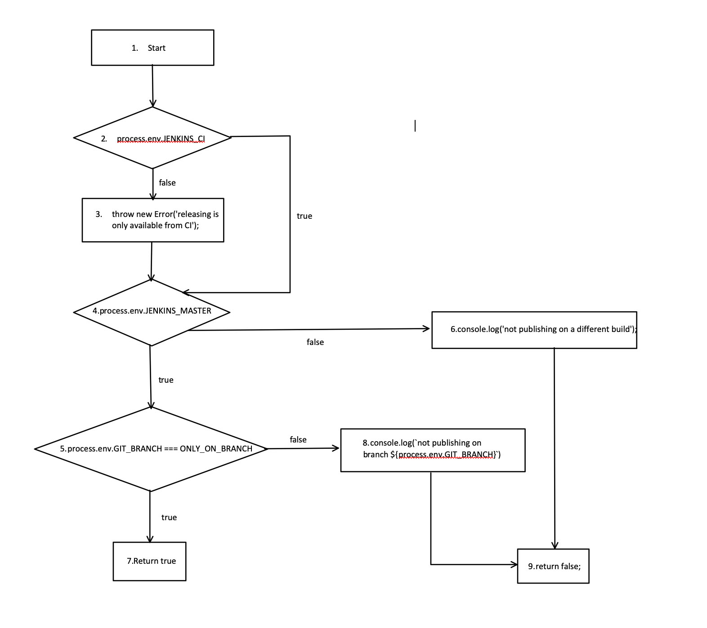

# **BÀI TẬP KIỂM THỬ**
### **- Họ và tên: Phạm Ngọc Tài**
### **- MSV: 16021415**
### **- Lớp: K61-CA-CLC2**
## **<u>Hàm đã chọn</u>**
## **<u>https://github.com/wix/react-native-calendars/blob/master/scripts/release.js</u>**
```javascript
1 function validateEnv() {
2        if (!process.env.JENKINS_CI) {
3               throw new Error('releasing is only available from CI');
4        }
5        if (!process.env.JENKINS_MASTER) {
6            console.log('not publishing on a different build');
7            return false;
8        }
9        if (process.env.GIT_BRANCH !== ONLY_ON_BRANCH) {
10                console.log(`not publishing on branch ${process.env.GIT_BRANCH}`);
11                return false;
12       }
13       return true;
14}
```
## **<u>Bước 1: Lập đồ thị</u>**

## **<u>Bước 2: Liệt kê các đường đi</u>**
#### **Đường đi số 1:** 1 &rarr; 2 &rarr; 3 &rarr; 4 &rarr; 5 &rarr; 7
#### **Đường đi số 2:** 1 &rarr; 2 &rarr; 4 &rarr; 5 &rarr; 7
#### **Đường đi số 3:** 1 &rarr; 2 &rarr; 3 &rarr; 4 &rarr; 6 &rarr; 9
#### **Đường đi số 4:** 1 &rarr; 2 &rarr; 3 &rarr; 4 &rarr; 5 &rarr; 8 &rarr; 9
#### **Đường đi số 5:** 1 &rarr; 2 &rarr; 4 &rarr; 6 &rarr; 9
#### **Đường đi số 6:** 1 &rarr; 2 &rarr; 4 &rarr; 5 &rarr; 8 &rarr; 9
## **<u>Bước 3: Lập phương trình đường đi</u>**
