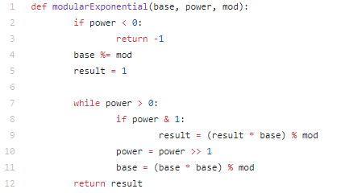
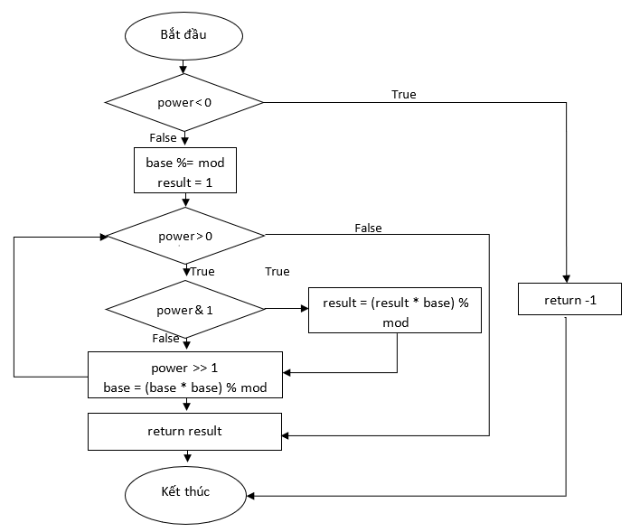

#Bài tập thực hành kiểm thử

**Họ tên: Phan Đăng Trung Hiếu**

#### Nguồn repo:

https://github.com/TheAlgorithms/Python/blob/master/maths/modular_exponential.py

#### Code:



### Bước 1: Lập đồ thị



### Bước 2: Lập đường đi

1. 2->3
2. 2->4->(7->8->9->10->11)->12
3. 2->4->(7->8->10->11)->12
4. 2->4->(7->8->9->10->11->7->8->10->11)->12

### Bước 3: Lập phương trình

**1. Đường đi 1:** 
Để từ lệnh 2 đến lệnh 3 thì lệnh 2 phải trả về True => power < 0
**2. Đường đi 2:** 
Để từ lệnh 2 đến lệnh 4 thì lệnh 2 phải trả về False => power  > 0 (1) 
Lệnh 4: base %= mod 
Lệnh 5: result = 1 
Để từ lệnh 8 đến lệnh 8 thì lệnh 7 phải trả về True => power > 0 (2)
Để từ lệnh 8 đến lệnh 9 thì lệnh 8 phải trả về True => power là số lẻ (3)
Lệnh 10: power >> 1 
Lệnh 11: base = (base * base) % mod 
Từ (1),(2),(3) => power là số dương lẻ
**3. Đường đi 3:** 
Để từ lệnh 2 đến lệnh 4 thì lệnh 2 phải trả về False => power  > 0 (1) 
Lệnh 4: base %= mod 
Lệnh 5: result = 1 
Để từ lệnh 8 đến lệnh 8 thì lệnh 7 phải trả về True => power > 0 
Để từ lệnh 8 đến lệnh 10 thì lệnh 8 phải trả về False => power là số chẵn 
Lệnh 10: power >> 1 
Lệnh 11: base = (base * base) % mod 
Từ (1),(2),(3) => power là số dương chẵn

#### Bước 4: Tạo các giá trị cho bộ kiểm thử:
**1. Đường đi 1:**
Giá trị đầu vào: power = -1, base = 2, mod = 11 
Giá trị đầu ra mong muốn: -1 
**2.Đường đi 2:**
Giá trị đầu vào: power = 9, base = 3, mod = 23 
Giá trị đầu ra mong muốn: 15 
**3.Đường đi 3:**
Giá trị đầu vào: power = 10, base = 5, mod = 17 
Giá trị đầu ra mong muốn: 9  








