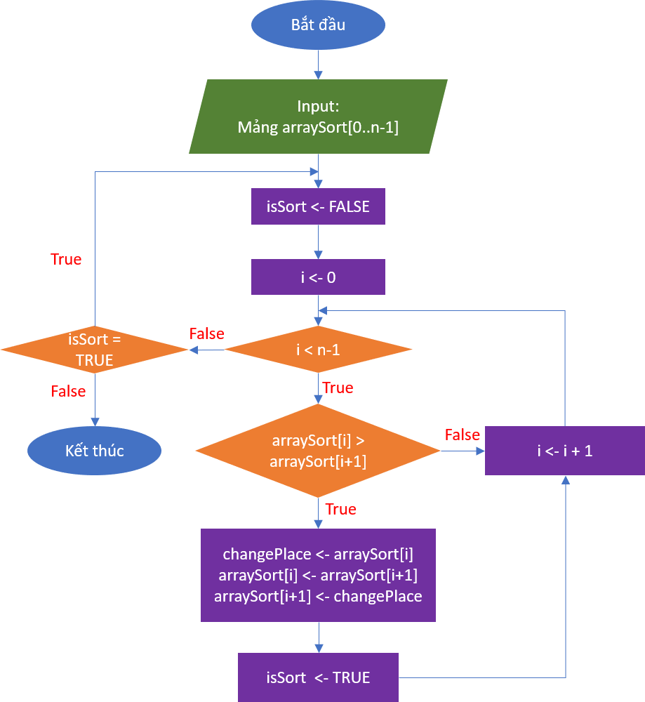

# Bài tập kiểm thử dòng điều khiển#
#### Họ và tên: Phí Văn Minh 
#### Mã sinh viên: 16022411


#### Chương trình: Sắp xếp nổi bọt nâng cao (BubbleSortAdvanced)
Repo: https://github.com/TheAlgorithms/C/blob/master/sorting/OtherBubbleSort.c


### Code: 
```
0	void bubbleSortAdvanced(int arraySort[], int n){
1		int isSort, changePlace;
2		do {
3			isSort = 0;
4			for (int i = 0; i < n-1; i++) {
5				if (arraySort[i] > arraySort[i+1]) {
6					changePlace = arraySort[i];
7					arraySort[i] = arraySort[i+1];
8					arraySort[i+1] = changePlace;
9					isSort = 1;
10				}
11			}
12		} while (isSort);
13	}
```
## Bước 1: Tạo đồ thị của hàm:


## Bước 2: Liệt kê các đường đi (Có 3 đường đi chính):
1, 1 &rarr; 2 &rarr; 3 &rarr; 4 &rarr; 12 </br>
2, 1 &rarr; 2 &rarr; 3 &rarr; 4 &rarr; 5 &rarr; 4 &rarr; 12 </br>
3, 1 &rarr; 2 &rarr; 3 &rarr; (4 &rarr; 5 &rarr; 6 &rarr; 7 &rarr; 8 &rarr; 9 &rarr; 4) &rarr; 12 &rarr; 2 &rarr; 3 &rarr; 4 &rarr; 5 &rarr; 4 &rarr; 12 </br>

## Bước 3: Xây dựng điều kiện đường đi, tính các giá trị kiểm thử thỏa mãn
### Đường đi 1:
Để 4 &rarr; 12 thì 0 < n-1 phải có giá trị false &rarr; n = 1, khi đó isSort = 0 (false) &rarr; Kết thúc </br>

### Đường đi 2:
Để 4 &rarr; 5 thì 0 < n-1 phải có giá trị true &rarr; n > 1  <-> n >= 2 (1)</br>
Để 5 &rarr; 4 thì arraySort[i] > arraySort[i+1] phải có giá trị false &rarr; Phần tử đầu nhỏ hơn phần tử thứ 2 (2)</br>
Để 4 &rarr; 12 thì 1 < n-1 phải có giá trị false &rarr; n <= 2, khi đó isSort = 0 (false) &rarr; Kết thúc (3)</br> 
(1) & (2) & (3) &rarr; n = 2 và phần tử đầu bé hơn phần tử thứ 2</br>

### Đường đi 3: Đường đi bên trong dấu () có tính lặp lại
Để 4 &rarr; 5 thì 0 < n-1 phải có giá trị true &rarr; n > 1  <-> n >= 2 (1)</br>
Để 5 &rarr; 6 &rarr; 7 &rarr; 8 &rarr; 9 &rarr; thì arraySort[i] > arraySort[i+1] phải có giá trị true &rarr; Phần tử đầu lớn hơn phần tử thứ 2 &rarr; Đổi chỗ 2 phần tử (2)</br>
Để 4 &rarr; 12 thì i < n-1 phải có giá trị false &rarr; n <= i + 1, khi đó isSort = 1 (true) &rarr; Quay lại 2 &rarr; 3 &rarr; 4 (3)</br> 
Để 4 &rarr; 5 thì 0 < n-1 phải có giá trị true &rarr; n > 1  <-> n >= 2 (4)</br>
Để 5 &rarr; 4 thì arraySort[i] > arraySort[i+1] phải có giá trị false &rarr; Phần tử trước nhỏ hơn phần tử sau (5)</br>
Để 4 &rarr; 12 thì i < n-1 phải có giá trị false &rarr; n <= i + 1, khi đó isSort = 0 (false) &rarr; Kết thúc (6)</br> 

(1,2,3,4,5,6) &rarr; n = 2 và phần tử đầu lớn hơn phần tử thứ 2 </br> 


## Bước 4: Tính giá trị mong đợi và tạo bộ kiểm thử hoàn chỉnh
### Đường đi 1:
- Input: n = 1, arraySort = [1]
- Expected Output: arraySort = [1]

### Đường đi 2:
- Input: n = 2, arraySort = [1,2]
- Expected Output: arraySort = []

### Đường đi 3:
- Input: n = 2, arraySort = [2,1]
- Expected Output: arraySort = [1,2]
