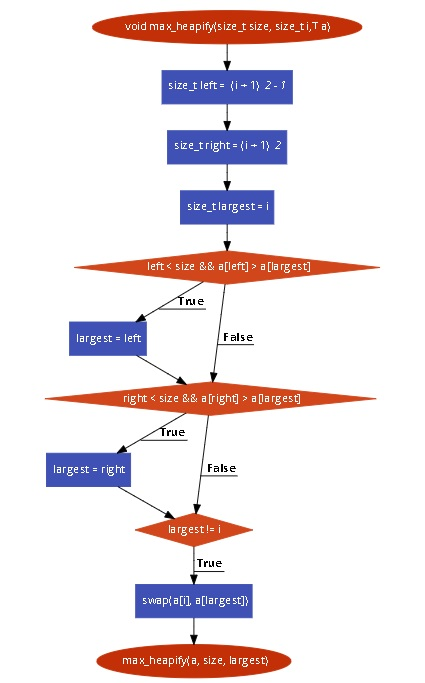

```
Bài tập kiểm thử dòng điều kiện
Họ tên: Trần Trường Giang
Lớp: K61-CA-CLC1
MSSV: 16020220
```
Hàm đã chọn: [max_heapify](https://github.com/allmycode/sort/blob/master/heapsort.hpp) 
```
void max_heapify(T a[], size_t size, size_t i) { //1
  size_t left =  (i + 1) * 2 - 1;                //2
  size_t right = (i + 1) * 2;                    //3
  size_t largest = i;                            //4
  if (left < size && a[left] > a[largest])       //5
    largest = left;                              //6
  if (right < size && a[right] > a[largest])     //7
    largest = right;                             //8
  if (largest != i) {                            //9   
    swap(a[i], a[largest]);                      //10
    max_heapify(a, size, largest);               //11
  }
}
```
Bước 1: Lập đồ thị


```
Bước 2: Liệt kê các đường đi
Đướng 1: 1-2-3-4-5-6
Đường 2: 1-2-3-4-7-8
Đường 3: 1-2-3-4-9-10-11

Bước 3: Lập phương trình đường đi
Đướng 1: 1-2-3-4-5-6
size_t left =  (i + 1) * 2 - 1
size_t right = (i + 1) * 2
size_t largest = i
true: left < size && a[left] > a[largest] <=> largest = left

Đướng 2: 1-2-3-4-7-8
size_t left =  (i + 1) * 2 - 1
size_t right = (i + 1) * 2
size_t largest = i
true: right < size && a[right] > a[largest] <=> largest = right

Đướng 3: 1-2-3-4-9-10-11
size_t left =  (i + 1) * 2 - 1
size_t right = (i + 1) * 2
size_t largest = i
true: largest!=i

Bước 4: Giải phương trình đường đi
T a[] = {1,2,3,4,5,6,7,8,9}
size = 9
i = 3 => size_t left = 7
      => size_t right = 8
      => size_t largest = 3
Vì left=7 < size=9 và a[left]=7 > a[largest]=3 => largest = left = 7
Vì right=8 < size=9 và a[right]=8 > a[largest]=7 => largest = left = 8
Vì largest=8 != i=3 => swap(a[i], a[largest])
                       max_heapify(a, size, largest)
```
