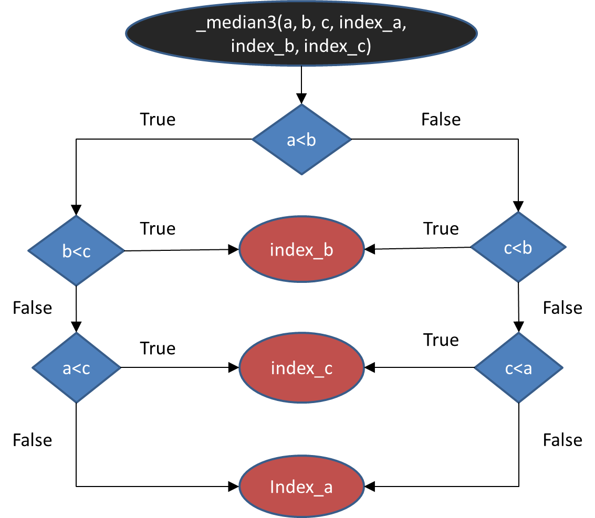

# BÀI TẬP KIỂM THỬ
###	_- Họ và tên: Võ Lê Minh Tâm_
### _- Mã sinh viên: 16020279_
### Link github https://github.com/mathics/Mathics/blob/master/mathics/algorithm/introselect.py
## Source code

    def _median3(a, b, c, index_a, index_b, index_c):		
    if a < b:											#1
        if b < c:										#2
            return index_b                              #3
        elif a < c:										#4
            return index_c  							#5
        else:											#6
            return index_a  							#7
    else:  												#8
        if c < b:										#9
            return index_b  							#10	
        elif c < a:										#11
            return index_c  							#12
        else:											#13
            return index_a  							#14

## Đồ thị của hàm

## Các đường đi

- Đường đi 1 : a < b &rarr; b < c &rarr; index_b
- Đường đi 2 : a < b &rarr; b < c &rarr; a < c &rarr; index_c
- Đường đi 3 : a < b &rarr; b < c &rarr; a < c &rarr; index_a
- Đường đi 4 : a < b &rarr; c < b &rarr; index_b
- Đường đi 5 : a < b &rarr; c < b &rarr; c < a &rarr; index_c
- Đường đi 6 : a < b &rarr; c < b &rarr; c < a &rarr; index_a

## Các biểu thức điều kiện đường đi, giá trị (a,b,c)thỏa mãn và các ca kiểm thử tương ứng
Giả sử index của a,b,c lần lượt là ia, ib, ic  

- Đường đi 1 : a < b < c  
    Bộ giá trị: (1,2,3)  
    Ca kiểm thử:
    + input: (1,2,3)  
    + output: ib

- Đường đi 2 : a < c <= b  
    Bộ giá trị: (1,4,3)  
    Ca kiểm thử:
    + input: (1,4,3)  
    + output: ic

- Đường đi 3 : c <= a < b  
    Bộ giá trị: (1,2,0)  
    Ca kiểm thử:
    + input: (1,2,0)  
    + output: ia

- Đường đi 4 : c < b <= a  
    Bộ giá trị: (5,2,1)  
    Ca kiểm thử:
    + input: (5,2,1)  
    + output: ib

- Đường đi 5 : b <= c < a  
    Bộ giá trị: (5,2,3)  
    Ca kiểm thử:
    + input: (5,2,3)  
    + output: ic

- Đường đi 6 : b <= a <= c  
    Bộ giá trị: (3,2,10)  
    Ca kiểm thử:
    + input: (3,2,10)  
    + output: ia

