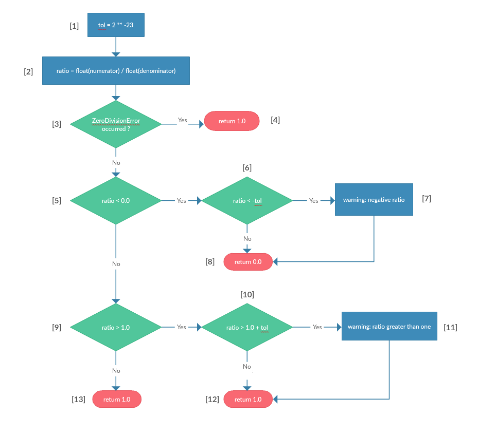

### **Vũ Minh Hiếu - 16022405**

# Link to the function
---
https://github.com/CharlesShang/FastMaskRCNN/blob/bdae07702acccd85803e658f5e49690981efcdb2/libs/boxes/gprof2dot.py#L82

# Source code
---
```python
def ratio(numerator, denominator):
    tol = 2 ** -23                                                          #[1]
    try:
        ratio = float(numerator)/float(denominator)                         #[2]
    except ZeroDivisionError:                                               #[3]
        # 0/0 is undefined, but 1.0 yields more useful results
        return 1.0                                                          #[4]
    if ratio < 0.0:                                                         #[5]
        if ratio < -tol:                                                    #[6]
            sys.stderr.write('warning: negative ratio (%s/%s)\n'
                             % (numerator, denominator))                    #[7]
        return 0.0                                                          #[8]
    if ratio > 1.0:                                                         #[9]
        if ratio > 1.0 + tol:                                               #[10]
            sys.stderr.write('warning: ratio greater than one (%s/%s)\n'
                             % (numerator, denominator))                    #[11]
        return 1.0                                                          #[12]
    return ratio                                                            #[13]
```

# Control Flow Graph
---


# Path analysis
---

### Case 1:
###### Path: [ 1 ] -> [ 2 ] -> [ 3 ] -> [ 4 ]
constrains|<li>denominator = 0</li><li>arbitrary numerator</li>
:--:|--
=>| <li>denominator = 0</li>


Input|Expected ouput|Expected message
:--:|:--:|:--:
17 , 0| 1.0|

### Case 2:
###### Path: [ 1 ] -> [ 2 ] -> [ 3 ] -> [ 5 ] -> [ 6 ] -> [ 7 ] -> [ 8 ]

constrains|<li>denominator != 0</li><li>ratio < 0.0</li><li>ratio < -tol</li>
:--:|--
=>|<li>denominator != 0</li><li>ratio < -2^-23</li>
=>|<li>denominator != 0</li><li>numerator / denominator < -2^-23</li>

Input|Expected ouput|Expected message
:--:|:--:|:--:
-3 , 1.2|0.0|warning: negative ratio (-3/1.2)

### Case 3:
###### Path: [ 1 ] -> [ 2 ] -> [ 3 ] -> [ 5 ] -> [ 6 ] -> [ 8 ]

constrains|<li>denominator != 0</br><li>ratio < 0.0</li><li>ratio >= -tol</li>
:--:|--
=>|<li> denominator != 0 </li><li> -2^-23 <= ratio < 0.0 </li>
=>|<li>denominator != 0</li><li>-2^-23 <= numerator / denominator < 0.0</li>

Input|Expected ouput|Expected message
:--:|:--:|:--:
1 , -2^7|0.0|

### Case 4:
###### Path: [ 1 ] -> [ 2 ] -> [ 3 ] -> [ 5 ] -> [ 9 ] -> [ 10 ] -> [ 11 ] -> [ 12 ]

constrains|<li>denominator != 0</li><li>ratio >= 0.0</li><li>ratio > 1.0</li><li>ratio > 1.0 + tol</li>
:--:|--
=>|<li>denominator != 0</li><li>ratio > 1.0 + 2^-23</li>
=>|<li>denominator != 0</li><li>numerator / denominator > 1.0 + 2^-23</li>

Input|Expected ouput|Expected message
:--:|:--:|:--:
2.6 , 3|1.0|warning: ratio greater than one (2.6, 3)

### Case 5:
###### Path: [ 1 ] -> [ 2 ] -> [ 3 ] -> [ 5 ] -> [ 9 ] -> [ 10 ] -> [ 12 ]

constrains|<li>denominator != 0</li><li>ratio >= 0.0</li><li>ratio > 1.0</li><li>ratio <= 1.0 + tol</li>
:--:|--
=>|<li>denominator != 0</li><li>1.0 <= ratio <= 1.0 + 2^-23</li>
=>|<li>denominator != 0</li><li>1.0 <= numerator / denominator <= 1.0 + 2^-23</li>

Input|Expected ouput|Expected message
:--:|:--:|:--:
1 + 7^-30 , 1.0|1.0|

### Case 6:
###### Path: [ 1 ] -> [ 2 ] -> [ 3 ] -> [ 5 ] -> [ 9 ] -> [ 13 ]

constrains|<li>denominator != 0</li><li>ratio >= 0.0</li><li>ratio <= 1.0</li>
:--:|--
=>|<li>denominator != 0</li><li>0.0 <= ratio <= 1.0</li>
=>|<li>denominator != 0</li><li>0.0 <= numerator / denominator <= 1.0</li>
=>|<li>numerator >= 0</li><li>denominator > 0</li><li>numerator <= denominator</li>

Input|Expected ouput|Expected message
:--:|:--:|:--:
2 , 4|0.5|

# Test cases
Case|Input|Expected ouput|message
:--:|:--:|:--:|:--:
1|17 , 0| 1.0|
2|-3 , 1.2|0.0|warning: negative ratio (-3/1.2)
3|1 , -2^7|0.0|
4|2.6 , 3|1.0|warning: ratio greater than one (2.6, 3)
5|1 + 7^-30 , 1.0|1.0|
6|2 , 4|0.5|
