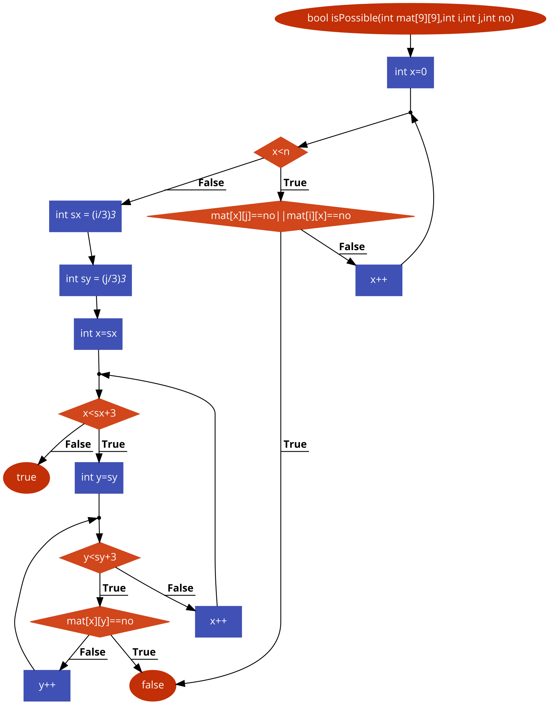

# Bài tập kiểm thử dòng điều kiện

### Họ tên: Vũ Phúc Hưng 
### MSSV: 16020237
### Lớp: K61-CA-CLC1


## **Hàm đã chọn**:
## https://github.com/TheAlgorithms/C-Plus-Plus/blob/master/Backtracking/sudoku_solve.cpp

```c++
1 bool isPossible(int mat[9][9],int i,int j,int no){
2   for(int x=0;x<n;x++){
3        if(mat[x][j]==no||mat[i][x]==no){
4            return false;
5        }
6    }
7    int sx = (i/3)*3;
8    int sy = (j/3)*3;
9    for(int x=sx;x<sx+3;x++){
10        for(int y=sy;y<sy+3;y++){
11            if(mat[x][y]==no){
12                return false;
13            }
14        }
15    }
16    return true;
17 }
```

## **Bước 1: Lập đồ thị**



## **Bước 2: Liệt kê các đường đi**

### **Đường số 1**: 1 &rarr; 2 &rarr; 3 &rarr; 4
### **Đường số 2**: 1 &rarr; 2 &rarr; 3 &rarr; 16
### **Đường số 3**: 1 &rarr; 2 &rarr; 7 &rarr; 8 &rarr; 9 &rarr; 10 &rarr; 11 &rarr; 12 
### **Đường số 4**: 1 &rarr; 2 &rarr; 7 &rarr; 8 &rarr; 9 &rarr; 10 &rarr; 11 &rarr; 16
### **Đường số 5**: 1 &rarr; 2 &rarr; 7 &rarr; 8 &rarr; 9 &rarr; 10 &rarr; 16
### **Đường số 6**: 1 &rarr; 2 &rarr; 7 &rarr; 8 &rarr; 9 &rarr; 16

## **Bước 3: Lập Phương trình của các đường đi**

### Đường 1:
    x = 0, x < n 
    mat[x][j]==no/mat[i][x]==no
    x++
    false

### Đường 2: 
    x = 0, x < n
    mat[x][j]!=no/mat[i][x]!=no
    true


### Đường 3;
    x > n
    sx = (i/3)*3;
    sy = (j/3)*3;
    x = sx, x < sx + 3
    y = sy, y < sy + 3
    mat[x][y] == no
    y++
    x++
    false

### Đường 4 
    x > n
    sx = (i/3)*3;
    sy = (j/3)*3;
    x = sx, x < sx + 3
    y = sy, y < sy + 3
    mat[x][y] /= no
    false

### Đường 5 
    x > n
    sx = (i/3)*3;
    sy = (j/3)*3;
    x = sx, x < sx + 3
    y = sy, y > sy + 3
    true

### Đường 6
    x > n
    sx = (i/3)*3;
    sy = (j/3)*3;
    x = sx, x > sx + 3
    true


## **Bước 4: Tính giá trị mong đợi và tạo bộ kiểm thử**
### Đường 1:
    input : 
        mat[9][9],2,3,5
    output :
        return false
### Đường 2: 
    input : 
        mat[9][9],3,4,6
    output :
        return true
### Đường 3;
    input : 
        mat[9][9],3,3,5
        =>sx = 3
        =>sy = 3
    output :
        return false

### Đường 4 
    input : 
        mat[9][9],2,2,5
        =>sx = 2
        =>sy = 2
    output :
        return false

### Đường 5 
    input : 
        mat[9][9],6,5,10
        =>sx = 6
        =>sy = 5
    output :
        return false

### Đường 6
    input : 
        mat[9][9],2,3,8
        =>sx = 2
        =>sy = 3
    output :
        return false

