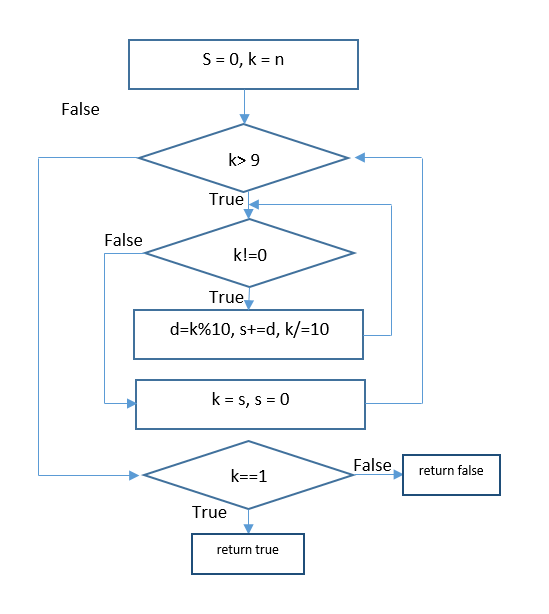

# Bài tập kiểm thử dòng điều khiển#
#### Họ và tên: Vũ Thị Thanh Lâm 
#### Mã sinh viên: 16020062


#### Chương trình: Kiểm tra số hạnh phúc (happy number)
Repo: https://github.com/TheAlgorithms/C-Plus-Plus/blob/master/Others/Happy_number.cpp

### Code: 
```
0 void isHappyNumber(int n){
1     int k = n, s = 0, d;
2     while(k > 9)
3     {
4         while(k != 0)
5         {
6             d = k%10;
7             s += d;
8             k /= 10;
9         }
10        k = s;
11        s = 0;
12    }
13    if (k == 1) 
14        return true;
15    else return false;
16 }
```
## Bước 1: Tạo đồ thị của hàm:

## Bước 2: Liệt kê các đường đi:
1, 1 &rarr; 2 &rarr; 13 &rarr; 14 </br>
2, 1 &rarr; 2 &rarr; 13 &rarr; 15 </br>
3, 1 &rarr; 2 &rarr; 4 &rarr; 6 &rarr; 7 &rarr; 8 &rarr; 4 &rarr; 6 &rarr; 7 &rarr; 8 &rarr; 4 &rarr; 10 &rarr; 11 &rarr; 2 &rarr; 13 &rarr; 14 </br>
4, 1 &rarr; 2 &rarr; 4 &rarr; 6 &rarr; 7 &rarr; 8 &rarr; 4 &rarr; 6 &rarr; 7 &rarr; 8 &rarr; 4 &rarr; 10 &rarr; 11 &rarr; 2 &rarr;x  13 &rarr; 15 </br>
## Bước 3: Xây dựng điều kiện đường đi, tính các giá trị kiểm thử thỏa mãn
### Đường đi 1:
Để 2 &rarr; 13 thì 2 phải có giá trị false &rarr; k > 9 false &rarr; k &leqslant; 9 (1) </br>
Để 13 &rarr; 14 thì 13 phải có giá trị true &rarr; k == 1 true &rarr; k = 1  (2)</br>
(1) & (2) &rarr; k = 1

### Đường đi 2:
Để 2 &rarr; 13 thì 2 phải có giá trị false &rarr; k > 9 false &rarr; k &leqslant; 9 (1) </br>
Để 13 &rarr; 15 thì 13 phải có giá trị false &rarr; k == 1 false &rarr; k != 1  (2)</br>
(1) & (2) &rarr; 1 &lt; k  &leqslant; 9

### Đường đi 3:
- Để 2 &rarr; 4 thì 2 phải có giá trị true &rarr; k > 9 true &rarr; k > 9 (1) </br>
- Để 4 &rarr; 6, 7, 8 thì 4 phải có giá trị true &rarr; k != 0 true (2) </br>
(1) & (2) &rarr; k > 9 (3) </br>
Theo dòng 8, k /= 10 (4) </br>
- Để 4 &rarr; 6, 7, 8 lần 2 thì 4 phải có giá trị true &rarr; k != 0 true (5) </br>
(4) & (5) &rarr; k > 9 (6) </br>
- Để 4 &rarr; 10, 11 thì 4 phải có giá trị false &rarr; k == 0 (7) </br>
(3) & (4) & (6) & (7) &rarr; 9 &lt; k &leqslant; 19 (8) </br>
- Dòng 6, 7: d = k % 10, s += d lặp 2 lần (9) </br>
- Dòng 10: k = s (10) </br>
- Để 2 &rarr; 13 thì 2 phải false &rarr; k &leqslant; 9 (11) </br>
(8) & (9) & (10) & (11) &rarr;  9 &lt; k &lt; 19 (12) </br>
- Để 13 &rarr; 14 thì  13 phải false &rarr; k == 1 true &rarr; tổng các chữ số ban đầu của k bằng 1 (13) </br>
(12) & (13) &rarr; k = 10

### Đường đi 4:
- Để 2 &rarr; 4 thì 2 phải có giá trị true &rarr; k > 9 true &rarr; k > 9 (1) </br>
- Để 4 &rarr; 6, 7, 8 thì 4 phải có giá trị true &rarr; k != 0 true (2) </br>
(1) & (2) &rarr; k > 9 (3) </br>
Theo dòng 8, k /= 10 (4) </br>
- Để 4 &rarr; 6, 7, 8 lần 2 thì 4 phải có giá trị true &rarr; k != 0 true (5) </br>
(4) & (5) &rarr; k > 9 (6) </br>
- Để 4 &rarr; 10, 11 thì 4 phải có giá trị false &rarr; k == 0 (7) </br>
(3) & (4) & (6) & (7) &rarr; 9 &lt; k &leqslant; 19 (8) </br>
- Dòng 6, 7: d = k % 10, s += d lặp 2 lần (9) </br>
- Dòng 10: k = s (10) </br>
- Để 2 &rarr; 13 thì 2 phải false &rarr; k &leqslant; 9 (11) </br>
(8) & (9) & (10) & (11) &rarr;  9 &lt; k &lt; 19 (12) </br>
- Để 13 &rarr; 14 thì  13 phải false &rarr; k == 1 false &rarr; tổng các chữ số ban đầu của k khác 1 (13) </br>
(12) & (13) &rarr; 10 &lt; k &lt; 19

## Bước 4: Tính giá trị mong đợi và tạo bộ kiểm thử hoàn chỉnh
### Đường đi 1:
- Input: n = 1
- Expected Output: True

### Đường đi 2:
- Input: n = 5
- Expected Output: False

### Đường đi 3:
- Input: n = 10
- Expected Output: True

### Đường đi 4:
- Input: n = 12
- Expected Output: False